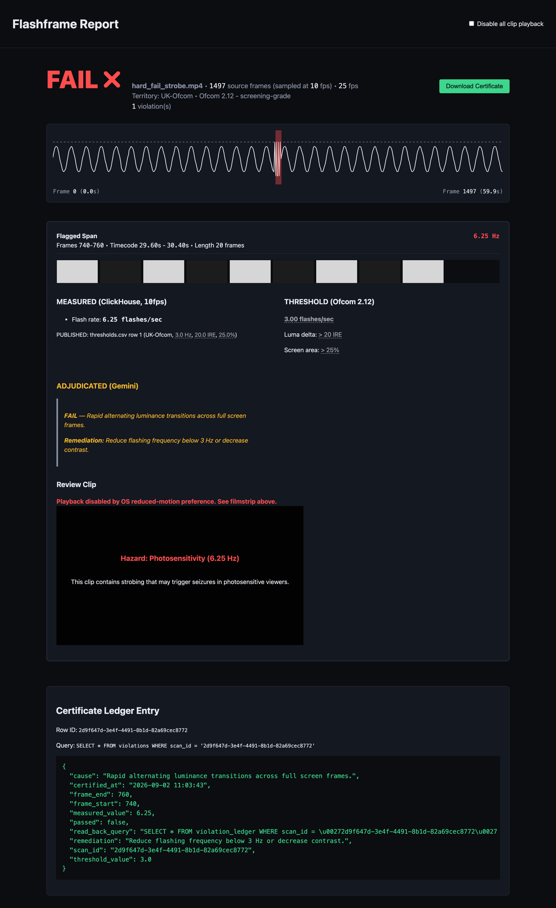
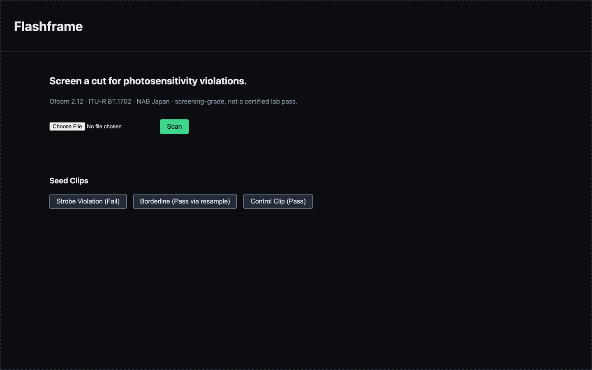
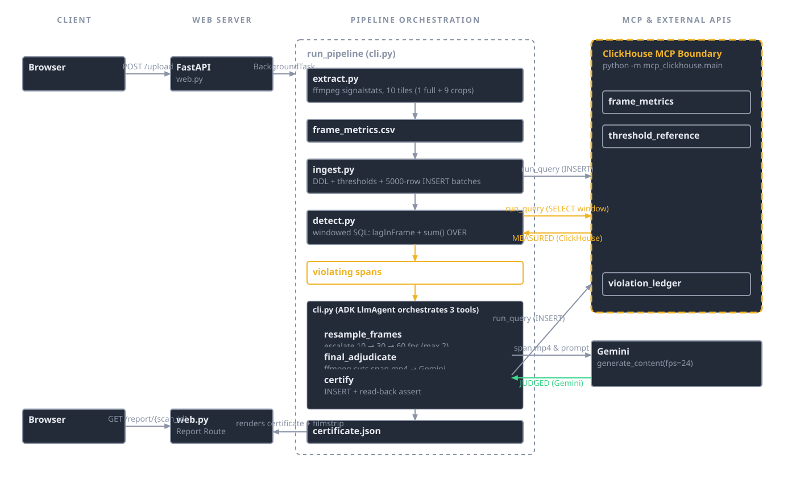

<div align="center">
  
  <h1>Flashframe 🎬</h1>
  <p><em>Upload a locked cut, get a broadcast photosensitivity safety certificate — before you pay for the lab pass.</em></p>
  

  <br/>

  <!-- ROW 1: CTA badges, for-the-badge style -->
  [](https://flashframe.edycu.dev)
  [](https://youtu.be/rPxGyYpVfAE)
  [](https://flashframe.edycu.dev/judge)
  [](https://agentic-cinema.devpost.com/)

  <br/>

  <!-- ROW 2: tech badges, flat style -->
  
  
  
  
  [](LICENSE)
  [](https://github.com/edycutjong/flashframe/releases/latest)
  [](https://github.com/edycutjong/flashframe/actions/workflows/ci.yml)

</div>

---

## 📸 See it in Action

<div align="center">
  
</div>

This is a real scan of the bundled `hard_fail_strobe.mp4` seed clip, resulting in a FAIL verdict with 1 violation across 1497 source frames. The flagged span at frames 740-760 (timecode 29.60s-30.40s) displays MEASURED (ClickHouse, 10fps) 6.25 flashes/sec against a THRESHOLD (Ofcom 2.12) of 3.00 flashes/sec, while ADJUDICATED (Gemini) names the cause as rapid alternating luminance transitions across full screen frames, along with a remediation. A Certificate Ledger Entry below shows the exact SQL read-back query and the stored row, reinforcing that measurement and judgement are shown as separate, separately-labelled things — ClickHouse measures, Gemini judges.

Note that the Review Clip panel reads 'Playback disabled by OS reduced-motion preference' because the capture honoured `prefers-reduced-motion` — this is the product refusing to autoplay strobing content at a viewer who asked for reduced motion, not a broken player.

<div align="center">
  
</div>

The zero-config entry point with the three bundled seed clips ready to scan.

## 💡 The Problem & Solution

### The Problem

Flashframe is a screening-grade pre-check against published ITU-R BT.1702 / Ofcom 2.12 / NAB-Japan criteria. 

### The Solution

Per-frame ffmpeg photometrics stream into ClickHouse; sliding-window SQL catches every flash sequence violating Ofcom 2.12 / ITU-R BT.1702 and resolves it to an exact frame span; Gemini reviews each flagged span and names the on-screen cause.

*(Note: Flashframe is a pre-check tool, and does not imply a lab pass or legal clearance.)*

## 🏗️ Architecture & Tech Stack



| Technology | Role |
|---|---|
| Python | Application runtime and pipeline orchestration |
| ClickHouse | Vectorized sliding-window photometric analysis via SQL |
| Gemini | Multimodal adjudication of flagged visual spans |
| FastAPI | HTTP API and web server |
| ffmpeg | Frame-by-frame photometric extraction |

## 🏆 ClickHouse & Gemini Integration

**Remove ClickHouse and you need several systems.** 

The detection *is* the SQL. When evaluating per-frame luma deltas, we rely directly on ClickHouse functions like `lagInFrame` to pair opposing-transitions identifying a flash as a *pair*, and windowed accumulations over sliding 1-second windows. Then, span refinement and merging happens natively so one continuous event reports as one span rather than as bucket fragments. Thresholds are joined from `threshold_reference`, never inlined. `run_chdb_select_query` joins the raw ffmpeg CSV **on disk** against `thresholds.csv` with no ETL step. 

This is not a toy aggregation; it is a specialized analytic query running in ClickHouse:

```sql
WITH
    framewise AS (
        SELECT frame_idx, pts_time, tile, yavg, red_ratio,
               yavg - lagInFrame(yavg) OVER (PARTITION BY tile ORDER BY frame_idx)              AS d_luma,
               sign(yavg - lagInFrame(yavg) OVER (PARTITION BY tile ORDER BY frame_idx))        AS dir
        FROM frame_metrics WHERE scan_id = current_scan
    ),
    transitions AS (
        SELECT frame_idx, pts_time, tile, red_ratio,
               (dir != lagInFrame(dir) OVER (PARTITION BY tile ORDER BY frame_idx)) AND (abs(d_luma) >= t_min_delta) AS is_flash,
               red_ratio > t_red_thresh AS is_red
        FROM framewise
    ),
    sliding AS (
        SELECT frame_idx, pts_time, tile, red_ratio, is_flash, is_red,
               sum(is_flash) OVER (PARTITION BY tile ORDER BY frame_idx ROWS BETWEEN {int(fps)-1} PRECEDING AND CURRENT ROW) AS window_flashes,
               max(is_red) OVER (PARTITION BY tile ORDER BY frame_idx ROWS BETWEEN {int(fps)-1} PRECEDING AND CURRENT ROW) AS window_red
        FROM transitions
    ),
    violating_windows AS (
        SELECT frame_idx AS window_end_idx, tile
        FROM sliding
        WHERE window_flashes > t_max_flashes OR window_red = 1
    ),
    violating_flashes AS (
        SELECT t.frame_idx, t.pts_time, t.tile, t.red_ratio
        FROM transitions t
        JOIN violating_windows vw ON t.tile = vw.tile AND t.frame_idx BETWEEN vw.window_end_idx - 24 AND vw.window_end_idx
        WHERE t.is_flash = 1
    ),
    merged_spans AS (
        SELECT min(frame_idx) AS frame_start, max(frame_idx) AS frame_end, tile,
               (count(DISTINCT frame_idx) / 2.0) / (greatest((max(frame_idx) - min(frame_idx) + 1) / 25.0, 1.0/25.0)) AS measured_rate,
               max(red_ratio) AS peak_red
        FROM violating_flashes
        GROUP BY tile
    )
SELECT frame_start, frame_end, measured_rate AS flashes, peak_red, tile
FROM merged_spans
ORDER BY flashes DESC
```

As the query shows, ClickHouse tracks opposing transitions (`dir != lagInFrame(...)`) to ensure a full flash is registered, not just a single brightness change. Then `sum(is_flash) OVER (...)` identifies offending windows, and `merged_spans` outputs the exact frame span. Without ClickHouse, replicating this logic securely and rapidly over large time-series datasets would require a heavier architecture involving stream processing frameworks or manual windowing code. All four MCP tools do real work: `run_query` in ingest/detect/certify and the report route; `list_databases` and `list_tables` in the startup schema preflight; `run_chdb_select_query` reading `thresholds.csv` with zero ETL in the same preflight.

**Remove Gemini and you ship a false-positive storm with no named cause.** 

The SQL finds *candidates*; many are legitimate. Blind test (`proof_7.py`, log committed): the SQL flags a 6 Hz flashing patch, and Gemini returns `passed=true` with *"a central white square … occupies roughly 17.4% of the screen, below the 25% area threshold"* — the true value is 17.36%. It also confirms the genuine hazard in Case A. Nothing in the SQL can look at the picture and say what the flashing thing *is*. 

The certification process leverages Gemini purely for human-like adjudication. When a span flags, the pipeline clips the exact frames using `ffmpeg` and prompts Gemini using the `gemini-3.6-flash` model:

```python
resp = client.models.generate_content(
    model=model,
    contents=[
        types.Part(
            inline_data=types.Blob(data=clip, mime_type="video/mp4"),
            video_metadata=types.VideoMetadata(fps=24)
        ),
        types.Part.from_text(text=f"The frame span from frames {frame_start} to {frame_end} in the source video corresponds to this short clip. The automated luminance scan flagged this span for potential photosensitivity hazards. Please analyze the visual content to determine if there are harmful flashes on screen, if they pass or fail the limit, and what on-screen content causes them.")
    ],
    config=types.GenerateContentConfig(
        response_mime_type="application/json",
        response_schema=Verdict,
        temperature=0.0
    ),
)
```

**The division of labour is the architecture, and it is stated in the product:** ClickHouse measures, Gemini judges. The report screen labels them separately — `MEASURED (ClickHouse, 60fps)` versus `ADJUDICATED (Gemini)`. This structural approach guarantees that we get deterministic measurements from ClickHouse while relying on Gemini's multimodal reasoning strictly for visual understanding, identifying causes, and providing remediation advice.

## 📊 Engineering Rigor

| Clip | Ground truth | Observed (SQL-measured) |
|---|---|---|
| `control_clean.mp4` | PASS, 0 spans | PASS, **zero** flagged spans |
| `hard_fail_strobe.mp4` | FAIL, frames 739-760 @ 6.25 flashes/sec | FAIL, frames 740-760 @ **6.25** — exact |
| `borderline_screen_area.mp4` | PASS only after resample, 2.5 flashes/sec | PASS, frames 1025-1055 @ **2.82** (+12.9 %) |

**Benchmark** — Conditions: 2026-09-01, freshly generated 138,240-frame clip (92 min 9.6 s at 25 fps), `frame_metrics` truncated to a single scan beforehand, N=5 iterations per run, ClickHouse Cloud 1 replica / 8 GiB / 2 vCPU / AWS ap-southeast-1.

We report the warm run (Run B) as the steady-state figure, and disclose the cold run (Run A) alongside it. Run A's p95 of 14.252 s on DETECT is a ClickHouse Cloud cold-start spike.

**Run B (Warm / Steady-State):**
| Stage | p50 | p95 |
|---|---|---|
| INGEST (bulk INSERT) | 2.888 s | 8.843 s |
| **DETECT (windowed SQL, data resident)** | **0.550 s** | **0.940 s** |
| TOTAL | 3.548 s | 9.471 s |

**Run A (First Run after truncation - Cold):**
| Stage | p50 | p95 |
|---|---|---|
| INGEST | 2.486 s | 3.379 s |
| DETECT | 0.423 s | 14.252 s |
| TOTAL | 2.910 s | 16.521 s |

*Note on timings: ffmpeg extraction and Gemini adjudication are excluded from the timed region. Manifest offset 57896 → detected span 57896, on all 5 iterations of both runs — 10/10, zero mismatches. Control feature: 0 false positives.*

**Disclose, don't bury:** INGEST is round-trip bound and likely dominated by MCP/HTTP rather than ClickHouse. Reporting the stages separately is deliberate — one blended TOTAL would incorrectly credit ClickHouse with transport latency.

## 🔁 The Resample Loop

First-pass extraction runs at 10 fps. At 10 fps the Nyquist limit is 5 Hz, so an N=5 alternation **aliases**: `borderline_screen_area` measured **2.08 flashes/sec** and looked like a violation. The ADK agent noticed the verdict was borderline and called `resample_frames` itself — 30 fps, then 60 fps — where the rate resolved to **2.82 flashes/sec** (against a ground truth of 2.5), correctly under the 3.0 limit. **PASS.** A naive single-pass tool reports a false FAIL on that clip.

The same mechanism corrected an *understated* hazard: `hard_fail_strobe` measured 5.0 flashes/sec at 10 fps and resolved to 6.25 after escalation — the exact constructed ground truth.

Console evidence, unedited:
```
Flagged span 1025-1055 (2.0833333333333335 flashes/sec)...
>>> resample_frames(span, 30) <<<
>>> resample_frames(span, 60) <<<
>>> adjudicate(1025, 1055) <<<
>>> certify <<<
```

Why not sample everything at 60 fps? Cost — a 90-minute feature at 60 fps is 6× the extraction and 6× the rows. The agent escalates only where a verdict is uncertain.

## 🚀 Getting Started

### Prerequisites

The hosted zero-config path needs none of this — it is browser-only. For the local path, you will need:
- **Python 3.13** (from the `Dockerfile`)
- **`ffmpeg`** binary installed on your system
- **ClickHouse credentials** living outside the repo, read from `CLICKHOUSE_HOST`, `CLICKHOUSE_USER`, and `CLICKHOUSE_PASSWORD` environment variables
- **Gemini credentials** living outside the repo, read from the `GEMINI_API_KEY` environment variable

### Installation

**Zero-config path:** Open the live URL (https://flashframe.edycu.dev), click one of the three bundled seed clips, and watch the scan. There is no upload, no arguments, and no flags to configure. There is no mock mode, no offline mode and no dry-run switch anywhere in the project.

**Local path:** 
```bash
git clone https://github.com/edycutjong/flashframe.git
cd flashframe
uv pip install -e . -r requirements.txt
# credentials from ~/.config
python -m flashframe.cli
```

## 🧪 Testing & CI

The test suite consists of 99 tests. Exactly **96 tests pass** with no credentials at all — the number a judge gets on a fresh clone. The remainder are 3 live-ClickHouse integration tests which skip cleanly without credentials, and they cover schema discovery, windowed SQL correctness, and chDB threshold joins. A CI workflow at `.github/workflows/ci.yml` runs the credential-free suite on every push and pull request with no secrets configured, so the green tick means the same thing a judge's own clone would give them. The suite includes defect-named regression tests: `test_span_duration_off_by_one` guards against the span-duration off-by-one that inflated measured flash rates, `test_gemini_estimate_separate_from_measurement` guards against the provenance bug that put Gemini's visual estimate into the SQL-measured field, and a third guards against the `report` handler swallowing an `HTTPException` to incorrectly return HTTP 200 instead of a 404 for an unknown `scan_id`. Statement coverage is 100% on 604 statements.

Regenerate all three seed clips and the 138,240-frame benchmark clip from source in one command each.

```bash
# Generate seed clips
python generator.py

# Run the pipeline
python -m flashframe.cli

# Run the benchmark
python bench.py
```
*(A judge must be able to re-derive every number above by running the code natively.)*

## 🔬 Methods

- **Screening-grade, not a certified lab test.** Flashframe measures **luma code value (Y′)** from the decoded signal under an assumed reference display. A certified test measures **photometric luminance at a calibrated display.**
- **Screen area is a 3×3 tiled proxy**, not true per-pixel measurement.
- **Measured accuracy against constructed ground truth is exact on the full-field case and +12.9 % on the small-area case, biased toward over-reporting.** For a screening tool that is the safer direction — it errs toward flagging for human review rather than clearing a genuine hazard — but a clip near the limit can be flagged conservatively. The residual bias was **disclosed rather than tuned away**, because adding a correction factor would invalidate the claim that thresholds come from published Ofcom / ITU-R criteria.
- **Gemini's figures are visual estimates, not measurements.** Across runs its flash-rate estimates were 5.0, 5.2, 5.7 and 6.25 against a ground truth of 6.25; screen area 17.4% and 20.3% against a true 17.36%. Every estimate fell on the correct side of its threshold — which is what the product needs from it — but the certificate's measured value comes from the SQL, never from Gemini.
- **Thresholds ship as inspectable data** (`thresholds.csv`), cited to source, so anyone can verify the arithmetic against the published criteria.

## ⚠️ Known Limitations

- Gemini API free tier: **5 requests/minute, 20/day per model**. The resample loop is multi-call, so a demo run may need spacing. The app catches 429 and says so rather than failing blankly.
- ClickHouse Cloud auto-suspends when idle; a cold first query costs **~25 s**. The server issues a warm-up query on startup and the UI says what is happening.
- Ingest is round-trip bound (see benchmark).

## 📄 License

MIT. See [LICENSE](LICENSE) for details.
